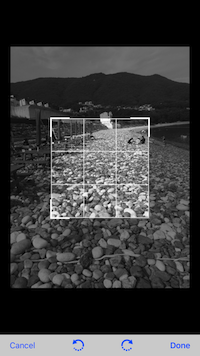
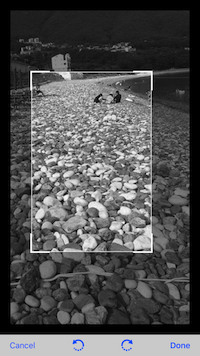
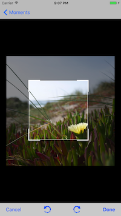

# PKCCrop


[](http://cocoapods.org/pods/PKCCrop)
[](http://cocoapods.org/pods/PKCCrop)
[](http://cocoapods.org/pods/PKCCrop)

## example Image







## Example

To run the example project, clone the repo, and run `pod install` from the Example directory first.

<br><br>

### - ViewController
~~~~

PKCCropHelper.shared.degressBeforeImage = UIImage(named: "pkc_crop_rotate_left.png")
PKCCropHelper.shared.degressAfterImage = UIImage(named: "pkc_crop_rotate_right.png")
PKCCropHelper.shared.isNavigationBarShow = false
let cropVC = PKCCrop().cropViewController(UIImage(named: "image.jpeg")!)
cropVC.delegate = self
self.present(cropVC, animated: true, completion: nil)

~~~~

<br>

### - PKCCrop Delegate


~~~~

extension ViewController: PKCCropDelegate{

    //return Crop Image & Original Image
    func pkcCropImage(_ image: UIImage?, originalImage: UIImage?) {

    }

    //If crop is canceled
    func pkcCropCancel(_ viewController: PKCCropViewController) {
        viewController.navigationController?.popViewController(animated: true)
    }

    //Successful crop
    func pkcCropComplete(_ viewController: PKCCropViewController) {
        if viewController.tag == 0{
            viewController.navigationController?.popViewController(animated: true)
        }else{
            viewController.dismiss(animated: true, completion: nil)
        }
    }

}

~~~~


<br><br>


## Installation

PKCCrop is available through [CocoaPods](http://cocoapods.org). To install
it, simply add the following line to your Podfile:

```ruby
pod "PKCCrop"
```

## Author

pikachu987, pikachu987@naver.com

## License

PKCCrop is available under the MIT license. See the LICENSE file for more info.
