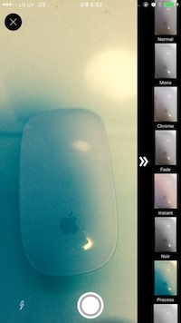
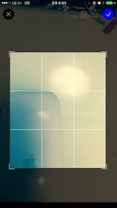
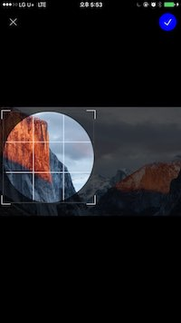

# PKCCrop


[](https://travis-ci.org/pikachu987/PKCCrop)
[](http://cocoapods.org/pods/PKCCrop)
[](http://cocoapods.org/pods/PKCCrop)
[](http://cocoapods.org/pods/PKCCrop)

## example Image






## Example

To run the example project, clone the repo, and run `pod install` from the Example directory first.

<br><br>

### - import the PKCCrop header

~~~~
import PKCCrop
~~~~

<br><br>

### - ViewController
~~~~
import PKCCheck

class ViewController: UIViewController{
  let pkcCrop = PKCCrop()
  override func viewDidLoad() {
        super.viewDidLoad()
        self.pkcCrop.delegate = self
    }
}

~~~~

<br><br>

### - PKCCrop Method

~~~~
pkcCrop.cameraCrop()
~~~~

>Extract images to crop from the camera.

>카메라에서 크롭할 이미지를 추출합니다.

<br><br>

~~~~
pkcCrop.photoCrop()
~~~~

>Extract the image to crop from the photobook.

>사진첩에서 크롭할 이미지를 추출합니다.

<br><br>

~~~~
pkcCrop.otherCrop(_ image: UIImage)
~~~~

>Insert the image and run the crop.

>이미지를 넣고 크롭을 실행합니다.

<br><br><br><br>


### - PKCCrop Delegate


~~~~

@extension ViewController: PKCCropDelegate{
    //If this function is set to false, 
    //the setting window will not be 
    //displayed automatically when the user does not give permission. 
    //If it is set to true or not, the setting window will be automatically opened. 
    //This feature is optional (not required).
    //false로 설정하면 사용자가 권한허용을 하지 않을때 설정창에 자동으로 가지 않습니다. 
    //true로 설정하면 사용자가 권한허용이 되어 있지 않을때 자동으로 설정창에 갑니다. 
    //해당 기능은 옵셔널입니다.(필수가 아님)
    func pkcCropAccessPermissionsChange() -> Bool {
        return true
    }
    
    
    //Called when the pkcCropAccessPermissionsChange 
    //function is set to false and the user has not granted permission.
    //This feature is optional (not required).
    //pkcCropAccessPermissionsChange 함수가 false로 설정되 있을때 
    //사용자가 권한허용을 하지 않았을 때 호출됩니다.
    //해당 기능은 옵셔널입니다.(필수가 아님)
    func pkcCropAccessPermissionsDenied() {
        
    }
    
    
    //You must put in the ViewController at this time.
    //현재 ViewController을 넣어야 합니다.
    func pkcCropController() -> UIViewController {
        return self
    }
    
    //The delegate to which the image is passed since the crop.
    //크롭이후 이미지가 전달이 되는 delegate입니다.
    func pkcCropImage(_ image: UIImage) {
        self.imageView.image = image
    }
}    
~~~~


<br><br>

### - Options

> PKCCropManager can change PKCCrop options with a singleton object.

> PKCCropManager 는 singleton 객체로 PKCCrop의 옵션들을 변경 할 수 있습니다.

<br><br>

~~~~
PKCCropManager.shared.cropType
~~~~

> This option is an enum and sets the crop type.

> 해당 옵션은 enum이며 크롭 타입을 설정합니다. 

~~~~
public enum PKCCropType{
    //freeRate And margin possible
    //자유크롭과 공백을 허용합니다.
    case freeRateAndMargin
    
    //freeRate And margin impossible
    //자유크롭과 공백을 허용하지 않습니다.
    case freeRateAndNoneMargin
    
    //rate And margin impossible
    //비율크롭과 공백을 허용합니다.
    case rateAndMargin
    
    //rate And margin impossible
    //비율크롭과 공백을 허용하지 않습니다.
    case rateAndNoneMargin
    
    //Rate crop and rotate the image. 
    //The image is in aspectFill format and the margins disappear. 
    //In addition, the rotation function is added. 
    //If you want to disable rotation, you can set isRotate to false in PKCCropManager.
    //비율크롭과 이미지를 회전할 수 있습니다. 
    //이미지가 aspectFill 형태로 되며 여백이 사라집니다. 
    //또한 회전기능이 추가됩니다. 
    //회전 기능을 빼시려면 PKCCropManager 에서 isRotate를 false로 하시면 됩니다.
    case rateAndRotate
    
    //Free crop and rotate images. 
    //The image is in aspectFill format and the margins disappear. 
    //In addition, the rotation function is added. 
    //If you want to disable rotation, you can set isRotate to false in PKCCropManager.
    //자유크롭과 이미지를 회전할 수 있습니다. 
    //이미지가 aspectFill 형태로 되며 여백이 사라집니다. 
    //또한 회전기능이 추가됩니다. 
    //회전 기능을 빼시려면 PKCCropManager 에서 isRotate를 false로 하시면 됩니다.
    case freeRateAndRotate
    
    //Ratio is a circle crop that allows cropping and spacing.
    //비율크롭과 공백을 허용한 동그라미 크롭입니다.
    case rateAndMarginCircle
    
    //Ratio is a circle crop that does not allow cropping and spacing.
    //비율크롭과 공백을 허용하지 않는 동그라미 크롭입니다.
    case rateAndNoneMarginCircle
    
    //It is a circle crop which can rotate ratio and image.
    //비율크롭과 이미지를 회전할수 있는 동그라미 크롭입니다.
    case rateAndRotateCircle
}
~~~~

> The structure of CropType is like this.

> CropType 의 구조는 이렇게 되어 있습니다.


<br>

~~~~
PKCCropManager.shared.cameraFilters
~~~~

> This option is Array [Filter] and you can give a list of filters when you run the camera.

> 해당 옵션은 Array[Filter] 이며 카메라를 실행 시켰을 때 필터 리스트를 줄 수 있습니다. 

~~~~
public struct Filter{
    var name: String
    var filter: CIFilter
    var image: UIImage
}
~~~~

> The structure of the Filter is as follows.

> Filter의 구조는 이렇게 되어 있습니다.

<br>


~~~~
PKCCropManager.shared.isZoom
~~~~

> This option is Bool and sets whether the Zoom option is enabled or not.

> 해당 옵션은 Bool 이며 Zoom 옵션을 실행할지 실행하지 않을지 설정합니다. 


<br>


~~~~
PKCCropManager.shared.isZoomAnimation
~~~~

> This option is Bool and sets whether the Zoom animation is enabled or not when the Zoom option is true.

> 해당 옵션은 Bool 이며 Zoom 옵션이 true일 경우 Zoom 애니메이션이 실행할지 실행하지 않을지 설정합니다.

<br>


~~~~
PKCCropManager.shared.isRotate
~~~~

> The function is Bool and asks if you want to rotate the image. CropType is only applicable to rateAndRotate, freeRateAndRotate, rateAndRotateCircle.

> 해당 기능은 Bool 이며 이미지를 회전할지 여부를 묻습니다. CropType이 rateAndRotate, freeRateAndRotate, rateAndRotateCircle 에서만 적용 가능 합니다.

<br>

~~~~
PKCCropManager.shared.setRate(rateWidth: CGFloat, rateHeight: CGFloat) -> Bool
~~~~

> The method sets the ratio when the ratio is Crop. The maximum difference between width and height should not be greater than 2. CropType is only applicable to rateAndMargin, rateAndNoneMargin, rateAndRotate.

> 해당해당 method 는 비율 크롭일때 비율을 설정합니다. width와 height의 최대 차이가 2를 넘어가게 하면 안됩니다. CropType이 rateAndMargin, rateAndNoneMargin, rateAndRotate 에서만 적용 가능 합니다.

<br>


<br><br><br><br>


<br><br>

## Requirements

PKCCheck is automatically added.
자동으로 PKCCheck가 추가됩니다.

## Installation

PKCCrop is available through [CocoaPods](http://cocoapods.org). To install
it, simply add the following line to your Podfile:

```ruby
pod "PKCCrop"
```

## Author

pikachu987, pikachu987@naver.com

## License

PKCCrop is available under the MIT license. See the LICENSE file for more info.
